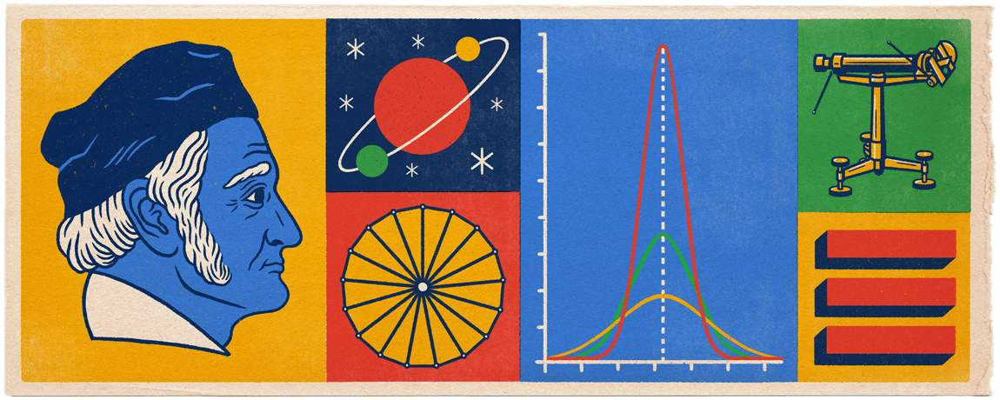
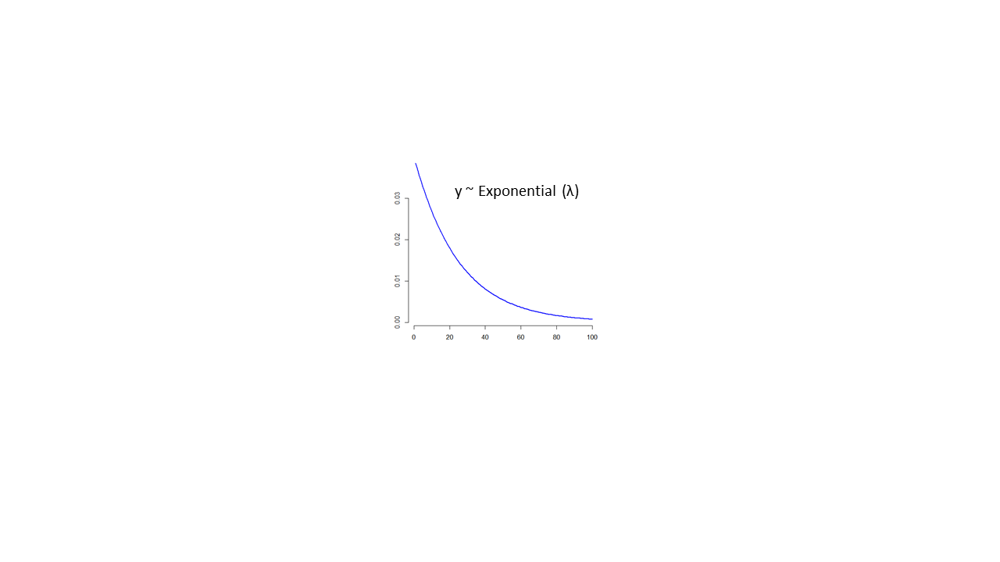
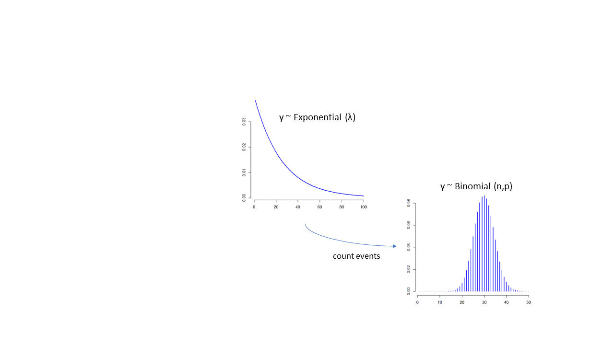
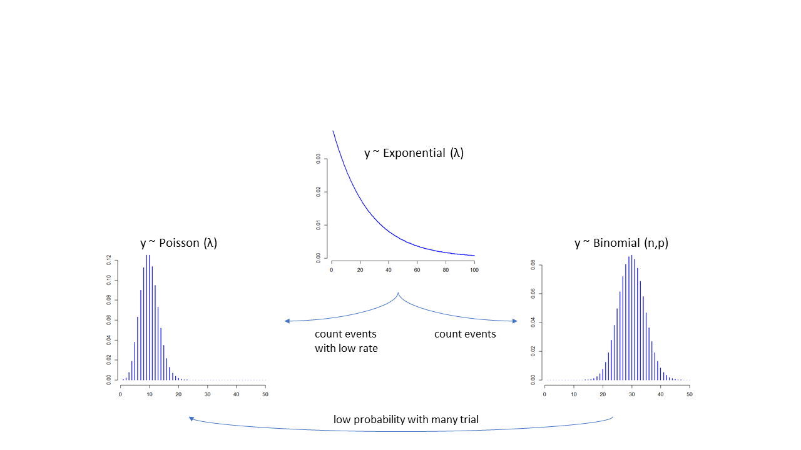
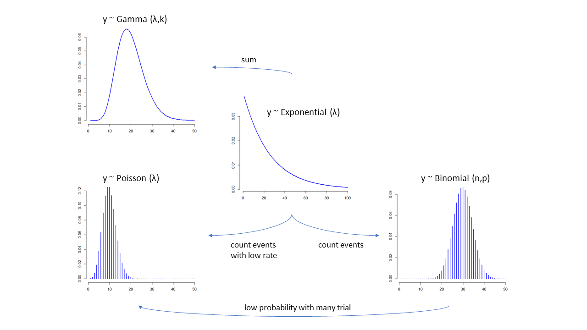
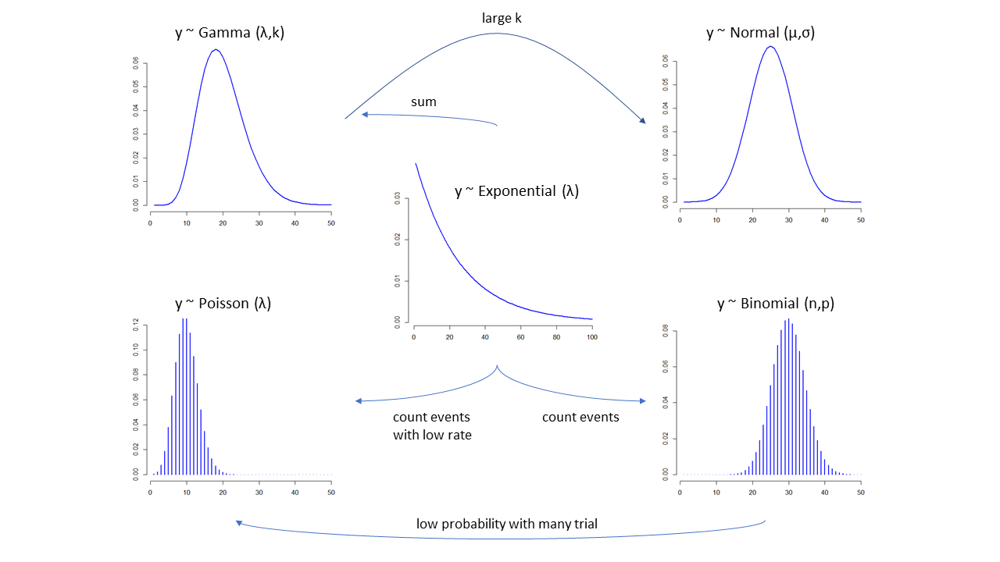
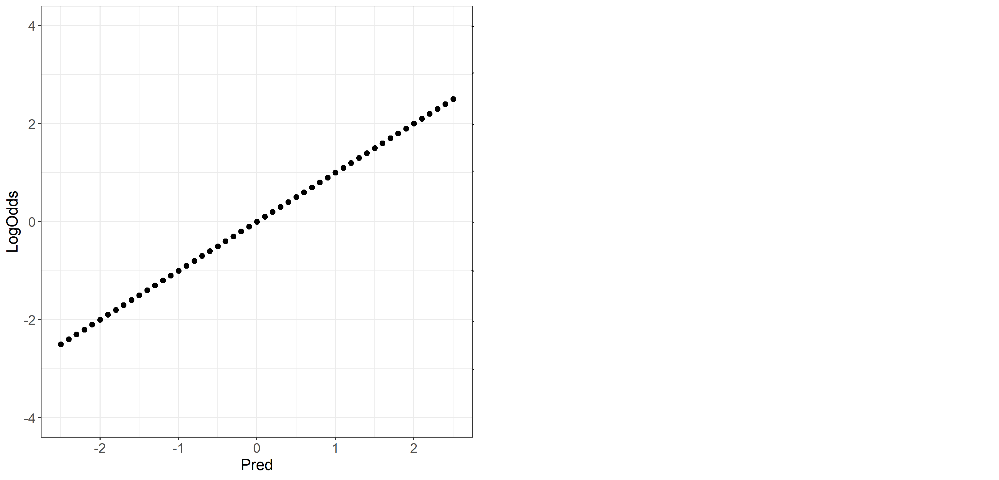
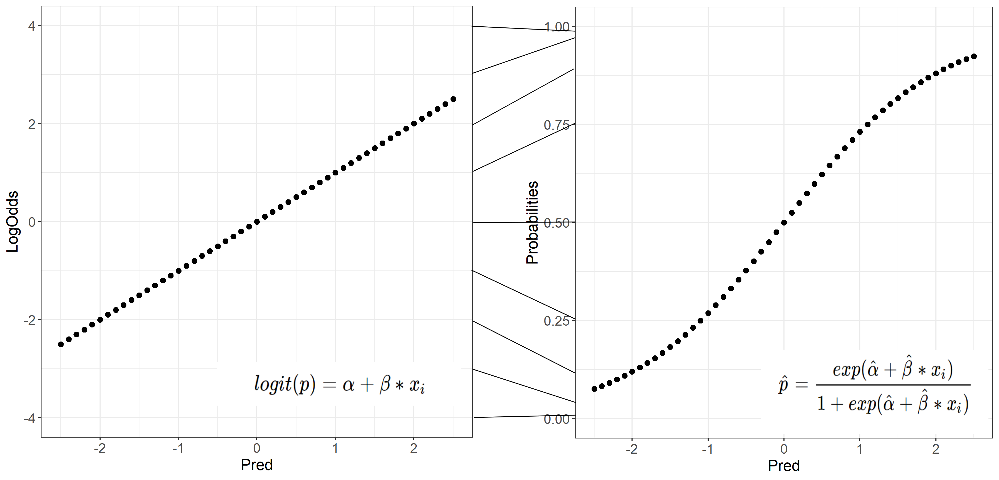
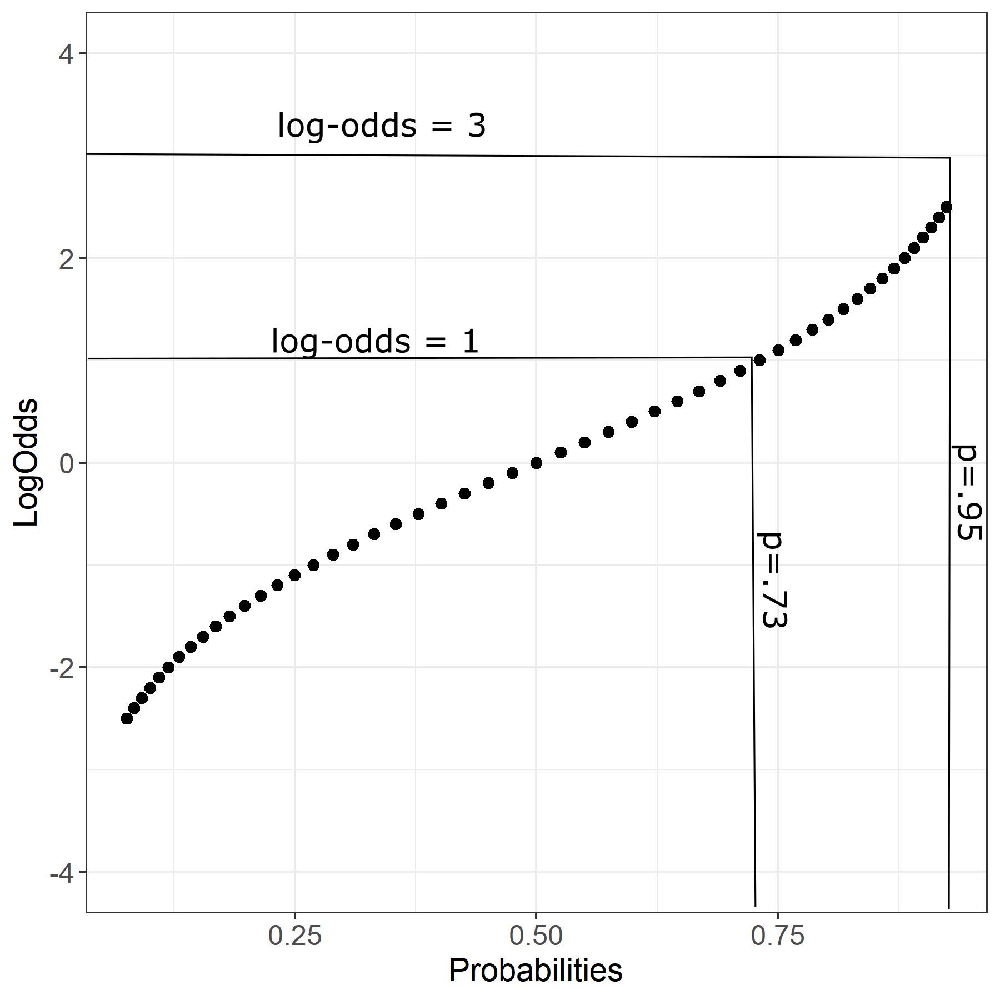
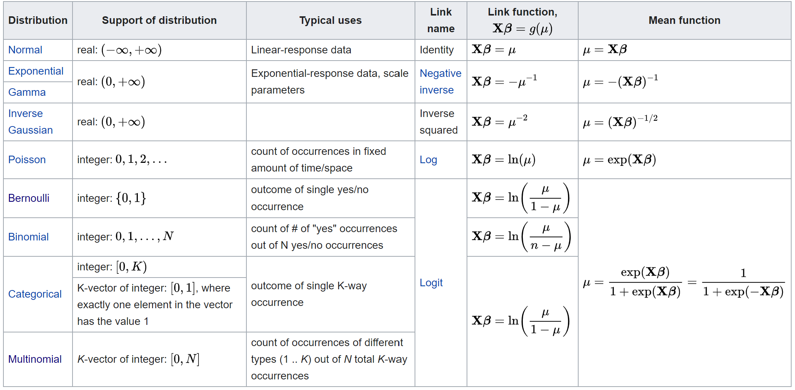

class: center, inverse
background-image: url("main2.png")
background-size: contain
---
<style type="text/css">
body, td {
   font-size: 15px;
}
code.r{
  font-size: 15px;
}
pre {
  font-size: 20px
}
.huge .remark-code { /*Change made here*/
  font-size: 200% !important;
}
.tiny .remark-code { /*Change made here*/
  font-size: 80% !important;
}
</style>

## Press record

```{r xaringanExtra-share-again, echo=FALSE}
xaringanExtra::use_share_again()
xaringanExtra::style_share_again(background="rgba(0,0,0,.2)",share_buttons = c("twitter","facebook"))
```

---

## Corrections from previous lecture
1. Intercept in the model with Age
<br/>
<br/>
2. Anova comparison

---

## First meeting exercises (Friday)
Did you manage to do any of those? 

---

##R code for this lecture

[Link](https://nvaci.github.io/Lecture_2_code/Lecture2_Rcode)

---

## What we know
.pull-left[
Gaussian distribution:
$y_{i} \sim \mathcal{N}(\mu_{i},\sigma)$ <br/> <br/>
$\mu_{i} = \alpha+\beta*x_i$ <br/><br/> 
Model mean and standard deviation <br/> <br/> 
<br/>
<br/>
a) Errors: $\mathcal{N}^{iid}(0,\sigma^2)$ <br/> <br/>
b) Linearity and additivity <br/> <br/>
c) Validity <br/> <br/>
d) Lack of perfect multicolinearity <br/> <br/>
]

.pull-right[
 <br/>
Google Doodle: Johann Carl Friedrich Gauß’s 241st Birthday
]

---

## What are these data? 
.center[

]
---

## Probability distributions 

Exponential family distribution:  <br/>  
.pull-left[Continous outcomes: <br/><br/>
Categorical outcomes (Yes/No or multiple outcomes):
<br/><br/><br/> 
Counted outcomes (Success, number of multiple outcomes, occurences in continuous domains): 
<br/><br/> <br/> <br/> <br/> 
+reals data (always positive):
]
.pull-right[
Normal (Gaussian) distribution<br/><br/>
Bernoulli distribution, Categorical distribution<br/><br/> <br/>

Binomial distribution, Multinomial distribution, Poisson distribution <br/><br/><br/><br/>

Exponential, Gamma or Inverse Gaussian <br/><br/>
]
---
## Exponential family
.center[
 <br/>
]

---
## Exponential family
.center[
 <br/>
]

---
## Exponential family
.center[
 <br/>
]
---
## Exponential family
.center[
 <br/>
]
---
## Exponential family
.center[
 <br/>
]
???
We can use all these functions as an outcome in the generalized linear models<br/>
Poisson - counts with no upper bound <br/>
Gamma - always positive, time to an event with multiple components (eg. age onset of cancer) <br/><br/>
Many of these distributions will converge to Normal: Binomial if the probability is far from edge, Poisson and Gamma if the mean is large - remember central limit theorem<br/><br/>
https://en.wikipedia.org/wiki/Exponential_family<br/><br/>
https://i.stack.imgur.com/HgpO4.jpg <br/><br/>
Check out amazing lectures from Richard McElreath (this lecture uses his idea extensively): [youtube channel](https://www.youtube.com/channel/UCNJK6_DZvcMqNSzQdEkzvzA)
---

## Binomial distribution
A coint is flipped 100 times, what is the probability that heads up results in 75 times? <br/><br/>

Number of successes of n number of independent Bernoulli trials -> Binomial distribution:<br/><br/> <br/>
$P(X=x)=(^n_x)p^x*(1-p)^{n-x}$ <br/><br/>
$\mu=n*p$ <br/><br/> $\sigma=n*p(1-p)$
---

## Babies

```{r,echo=F}
set.seed(456)
Babies=data.frame(Age=round(runif(100,1,30)), Weight=rnorm(100,4000,500))
Babies$Height=rnorm(100,40+0.2*Babies$Age+0.004*Babies$Weight, 5)
Babies$Gender=rbinom(100,1,0.5)
Babies$Crawl=rbinom(100,1,0.031*Babies$Age+0.00001*Babies$Weight-0.06*Babies$Gender)
Babies$Gender=as.factor(Babies$Gender)
levels(Babies$Gender)=c('Girls','Boys')
table(Babies$Crawl)
```

```{r,fig.width=14, fig.height=5, fig.align='right'}
par(mfrow=c(1,1), bty='n',mar = c(5, 4, .1, .1), cex=1.1, pch=16)
plot(1:100,dbinom(1:100,0.63, size=100), xlab='N of babies crawling', ylab='Probability', type='l')
```

---

## Babies

$\mu=100*0.63=63$ <br/><br/> $\sigma=\sqrt(100*0.63*(1-0.63))=4.82$

Exactly:

```{r}
x=75
choose(100, x)*0.63^x*(1-0.63)^(100-x)
```

At least:

```{r}
x=64:100
sum(choose(100, x)*0.63^x*(1-0.63)^(100-x))
```

---

## Logistic regression
Distribution: <br/>
$$y_i \sim Binomial(n,p)$$
$$p=\alpha+\beta*x_i$$
--

Map values to [0,1]: <br/>
$$f(p) =log(\frac{p}{1-p})$$
$$logit(p)=\alpha+\beta*x_i$$


???
Our y or the outcome are counts that are following Binomial distribution.<br/>
What we would like to estimate/model is the probability (p)<br/>
What would happen if we would model probability using linear regression?<br/><br/>
We have these issues:<br/>
Errors are not necessarily normal <br/>
Mean and SD are related <br/>
Linear function is unbounded - does not have to result in a number between 0 and 1 <br/>

---

## First step
$$Odds =\frac{p_{i}}{1-p_{i}}$$


```{r, echo=FALSE, message=FALSE, fig.width=12, fig.height=5, fig.align='center'}
require(ggplot2)
logit<-data.frame(LogOdds=seq(-2.5,2.5, by=.1), Pred=seq(-2.5,2.5, by=.1))
logit$Odds=exp(logit$LogOdds)
logit$Probabilities=logit$Odds/(1+logit$Odds)

ggplot(data = logit, aes(x=Pred, y=Odds))+geom_point(size=2)+theme_bw()+ylim(0,13)+theme(axis.title=element_text(size=14), axis.text =element_text(size=12))
```

---

## Second step

$$logOdds =log(\frac{p_{i}}{1-p_{i}})$$

```{r, echo=FALSE, message=FALSE, fig.width=12, fig.height=5, fig.align='center'}
ggplot(data = logit, aes(x=Pred, y=LogOdds))+geom_point(size=2)+theme_bw()+ylim(-4,4)+theme(axis.title=element_text(size=14), axis.text =element_text(size=12))
```

---

## What is the model doing?


---

## What is the model doing?



---

## Relation between LogOdds and Probabilities
.center[

]
---

## Generalized linear models
.center[

]

---

## Logistic regression in R

We return back to our crying babies that are motivated to start crawling. 

```{r, fig.width=12, fig.height=5, fig.align='center'}
par(mfrow=c(1,3), bty='n',mar = c(5, 4, .1, .1), cex=1.1, pch=16)
plot(Babies$Age, Babies$Height, xlab='Age (months)', ylab='Height (cm)')
boxplot(Babies$Height~Babies$Gender,xlab='Gender', ylab='Height (cm)')
boxplot(Babies$Age~Babies$Crawl,xlab='Crawl', ylab='Age (months)')
```

---

## Logistic regression in R: coefficients

Predict crawling success as a linear function of age

```{r}
glm1<-glm(Crawl~Age, data=Babies, family=binomial(link='logit'))
glm1$coefficients
```
<br/><br/>
Three ways to interpret logistic regression:<br/><br/>
 1. Logit values<br/>
 2. Odds ratios<br/>
 3. Probabilities<br/>

---

## Odds ratios

```{r}
glm1$coefficients
exp(glm1$coefficients)
```

Intercept: When Age is zero (birth), the odds of babies starting to crawl are 74% (1-.26) less likely than not to crawl. 

Age: Babies one month older are 12% more likely to start crawling

---

## Probabilities

$\frac{1}{1+exp^{-(\alpha+\beta*x)}}$<br/><br/>

```{r}
1/(1+exp(1.33078))
```

Intercept: Estimated probability of babies starting to crawl when Age is 0 (birth)<br/><br/>

Age - we need to look where to evaluate changes on the curve:<br/>


```{r}
1/(1+exp(1.33078-0.11948*10))
arm::invlogit(coef(glm1)[[1]]+coef(glm1)[[2]]*mean(Babies$Age))
```

---
## Interpretation continued

```{r, fig.width=12, fig.height=5, fig.align='center'}
Babies$LogOdds=-1.33078+0.11948*Babies$Age
Babies$Odds=exp(Babies$LogOdds)
Babies$Probs=Babies$Odds/(1+Babies$Odds)
par(mfrow=c(1,3), bty='n',mar = c(5, 4, .1, .1), cex=1.1, pch=16)
plot(Babies$Age,Babies$LogOdds)
plot(Babies$Age, Babies$Odds)
plot(Babies$Age,Babies$Probs)
```

---

## Predicted probability versus outcome

```{r, fig.width=12, fig.height=5, fig.align='center'}
ggplot(data=Babies, aes(x=Age, y=Probs))+geom_point(size=2, col='blue')+geom_point(data=Babies, aes(x=Age, y=Crawl), size=2, col='red')
```

---

## Model results

```{r, size='tiny'}
summary(glm1)
```
???
[Wald test](https://stats.stackexchange.com/a/60083)
---


## Logistic regression formula

What is missing in this equation? 

$$log(\frac{p}{1-p})=\alpha+\beta*x_i$$ <br/> <br/>

$$ y = \alpha + \beta * Age + \epsilon $$  <br/><br/>

--

We do not have an estimation of error: $y_i \sim Binomial(n,p)$

We do have residuals - estimate of the fit <br/>

$$residual_i=-2*(y_i-logit^{-1}(\beta*x_i))$$

---

## Deviance

Goodness of fit: deviance of the fitted model with respect to a perfect model <br/><br/>
Null deviance: $D=-2*loglik(\beta_0)$ <br/><br/>
Residual deviance: $D=-2*loglik(\beta*x)$ <br/><br/>

```{r}
with(glm1, pchisq(null.deviance - deviance, df.null - df.residual, lower.tail = FALSE))
```

AIC: $-2loglik(\beta*x)+2*npar$<br/><br/>
BIC: $-2loglik(\beta*x)+log(number of observations)*npar$

???
Deviance: Tests whether the model is more accurate than simply always guessing that the outcome will be the more common of the two categories
---
## Link functions and other GLMs

We can also use other link functions:  <br/><br/>
- Probit: $p = \Phi(\beta*x_i)$
- Cauchit
- log and cloglog (complementary log-log)
 <br/><br/> <br/>
 Most common Generalized linear models:
 - Poisson regression: traffic, goals in a soccer game <br/>
 - Negative binomial: same problems but deals with overdispersion <br/>
 - Gamma regression: reaction times? always positive right skewed data <br/>
---
## Absolutely cool things to note 

The question that we are asking is can we stratify the probability of a success in outcome using our predictor variables <br/><br/>

We are modelling the mean and we do not have an information on individual data points - no error <br/><br/>

The scale of parameters is different! <br/><br/>

Parameters are multiplicative - everything interacts especially in the tails of probability distribution <br/><br/>

Not easy to compare the models - especially if they differ in a more than one predictor - deviance criteria gives you information how well you model fits the mean <br/>

---

class: inverse, middle, center
# Practical aspect
---

## Data

NBA dataset: [Link](https://www.kaggle.com/ionaskel/nba-games-stats-from-2014-to-2018)

```{r}
basketball<-read.table('Basketball.txt',sep='\t', header=T)
knitr::kable(head(basketball[,c(5,13,18,31,34,43)]), format = 'html')
```

---

## Data

```{r}
table(basketball$Win)
```
```{r, echo=F, fig.width=12, fig.height=5, fig.align='center'}
par(mfrow=c(1,2), bty='n',mar = c(5, 4, .1, .1), cex=1.1, pch=16)
plot(density(basketball$X3PointShots.), main='', xlab='3POintsShots')
plot(density(basketball$Opp.3PointShots.), main='', xlab='Opp3PointsShots')
```

---

## Cross tabulation

```{r}
knitr::kable(table(basketball$Win, basketball$Home), format = 'html')
datA=aggregate(cbind(basketball$X3PointShots., basketball$Opp.3PointShots., basketball$FreeThrows., basketball$Opp.FreeThrows.), list(basketball$Win), mean)
names(datA)=c('Win','X3POints_mean','Opp3POints_mean','FreeThrows_mean','OppFreeThrows_mean')
knitr::kable(datA, format = 'html')
```

---

## Plot

```{r, fig.width=12, fig.height=5, fig.align='center'}
par(mfrow=c(1,2), bty='n',mar = c(5, 4, .1, .1), cex=1.1, pch=16)
plot(basketball$X3PointShots.,basketball$Win)
plot(basketball$X3PointShots.,jitter(basketball$Win, 0.5))
```
---

## Logistic Regression: one predictor
.tiny[
```{r, size="tiny"}
baskWL1<-glm(Win~Home, data=basketball, family=binomial('logit'))
summary(baskWL1)
```
]
---

## Logistic Regression: two predictors
.tiny[
```{r, size="tiny"}
baskWL2<-glm(Win~Home+X3PointShots., data=basketball, family=binomial('logit'))
summary(baskWL2)
```
]
---
## Model comparison

```{r}
anova(baskWL1, baskWL2, test = "LR")
```

---
## Logistic Regression: three predictors
.tiny[
```{r, size="tiny"}
baskWL3<-glm(Win~Home+X3PointShots.+Opp.3PointShots., data=basketball, family=binomial('logit'))
anova(baskWL1,baskWL2, baskWL3, test = "LR")
```

```{r, size="tiny"}
baskWL4<-glm(Win~Home*X3PointShots.+Opp.3PointShots., data=basketball, family=binomial('logit'))
anova(baskWL3, baskWL4, test = "LR")
```
]
---
## Visualising results

```{r,fig.width=12, fig.height=5, fig.align='center'}
basketball$Prob_mod2=predict(baskWL2, type='response')
ggplot(data=basketball, aes(x=X3PointShots., y=Prob_mod2, colour=Home))+geom_point(size=2)+geom_point(data=basketball, aes(x=X3PointShots., y=Win), size=2, col='blue')
```

---
## Visualising results

```{r,fig.width=12, fig.height=5, fig.align='center'}
basketball$Prob_mod3=predict(baskWL3, type='response')
ggplot(data=basketball, aes(x=X3PointShots., y=Prob_mod3, colour=Home))+geom_point(size=2)+geom_point(data=basketball, aes(x=X3PointShots., y=Win), size=2, col='blue')
```

---

## Confidence intervals and R2

```{r}
confint(baskWL3)
```

```{r, warning=F, message=F}
require(DescTools)
PseudoR2(baskWL3, which='McFadden')
PseudoR2(baskWL3, which='Nagelkerke')
```

[Pseudo R2 formulas](https://stats.idre.ucla.edu/other/mult-pkg/faq/general/faq-what-are-pseudo-r-squareds/)
---

## Model check

```{r}
Ctabs<-table(basketball$Win,basketball$Prob_mod3>0.5)
Ctabs
```

Recall: $\frac{true positive}{true positive+false negatives}=\frac{62}{62+19}=0.76$ <br/><br/>
Precision: $\frac{true positives}{true poisitives + false positives}=\frac{62}{62+22}=0.73$<br/><br/>
F1 score: $2*\frac{Precision * Recall}{Precision+Recall} = 0.74$
???
https://en.wikipedia.org/wiki/Precision_and_recall
---
## Important aspects: theory

- How do we use linear model with the non-normal outcomes (link functions) <br/><br/>
- What are logit values, how do we get to them <br/><br/>
- How to interpret logistic regression: logits, odds, and probabilities<br/><br/>
- What is deviance of the model and AIC 

---
## Important aspects: practice

- Building a logistic model <br/><br/>
- Predicting values from logistic model <br/><br/>
- Transforming logit values to odds and to probabilities<br/><br/>
- Comparing models using deviance, anova function or AIC information<br/><br/>
- Cross-tabulating model predictions with observed data

---
## Literature

Chapter 5 of "Data Analysis Using Regression and Multilevel/Hierarchical Models" by Andrew Gelman and Jennifer Hill  <br/>

Chapter 10 of "Statistical Rethinking: A Bayesian Course with Examples in R and Stan " by Richard McElreath + check out his youtube channel

Jaeger, F. (2008). Categorical data analysis: Away from ANOVAs (transformation or not) and towards logit mixed models. Journal of Memory and Language, 59, 434-446. 

---

# Thank you for your attention