class: center, inverse
background-image: url("40084978.jpg")

# Lecture 3: Path models (Structural Equation Modelling) 

### Dr Nemanja Vaci
---

<style type="text/css">
body, td {
   font-size: 15px;
}
code.r{
  font-size: 15px;
}
pre {
  font-size: 20px
}
.huge .remark-code { /*Change made here*/
  font-size: 200% !important;
}
.tiny .remark-code { /*Change made here*/
  font-size: 80% !important;
}


</style>

## Press record

```{r xaringanExtra-share-again, echo=FALSE}
xaringanExtra::use_share_again()
xaringanExtra::style_share_again(background="rgba(0,0,0,.2)",share_buttons = c("twitter","facebook"))
```

---

## Corrections from the previous lecture

---

## R code

[Link](https://nvaci.github.io/Lecture_3_code/Lecture3_Rcode.html)

---

## Structural equation modelling (SEM)

General framework that uses various models to test relationships among variables <br/>

Other terms: covariance structure analysis, covariance structure modelling, __causal modelling__<br/>

a) Regression model <br/>
 - Legendre or Gauss (1805)<br/>

b) Confirmatory factor analysis<br/>
 - Howe (1955), Anderson & Rubin (1956), Karl Joreskog (1963)<br/>
 - Latent factor structure - Spearman (1904, 1927) <br/>
 
c) Path model <br/>
 - Sewell Wrigh (1918, 1921)<br/>
 
d) Structural equation modelling: confirmatory factor + path model

---

## Terminology

Manifest variables: observed/collected variables <br/> <br/> 
Latent variables: infered measures - hypothetical constructs  <br/>
 - Indicator variables: measures used to infer the latent concepts
<br/>
<br/> 

Endogenous variables: dependent outcomes <br/> <br/> 
Exogenous variables: predictors <br/> <br/> <br/> 

Focus on covariance structure instead of mean <br/> <br/> 

---

##  Graphical representation of the model

.center[
 <br/>
]
---

## Prerequisites

Theory: Strong theoretical assumptions that could be tested using the data and specification of the model <br/><br/>

Data: large samples, N:p rule - 20:1, more data usually better estimates. <br/>
 - We are not that interested in significance: <br/><br/>
  a) Overall behaviour of the model more interesting<br/><br/>
  b) More data higher probability of significant results (weak effects)<br/><br/>
  c) Latent models are estimated by anchoring on indicator variables, different estimation can result in different patterns<br/><br/>
  d) Not that interesting theoretically<br/>

---

## Path analysis

Moderation, Mediation and Conditional Process Analysis <br/><br/>
---

## Path analysis 

Moderation: An association between two variables is moderated when its size or sign depends on the values of the third variable <br/><br/>

.center[
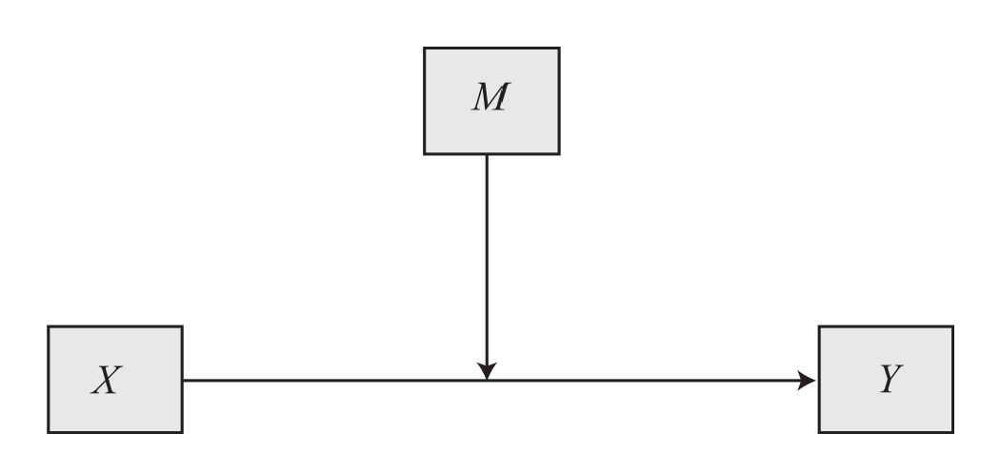 <br/>
]

---

## Path analysis

Mediation: Variation in X variable influences variation in one of the mediators, which in turn result in variation in Y <br/><br/>

.center[
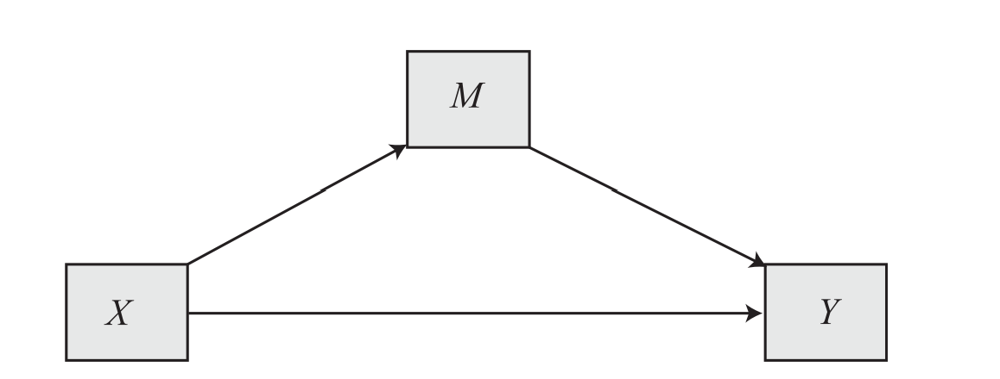 <br/>
]

---

## Path analysis

Conditional process analysis: combination of mediation and moderation <br/>

.center[
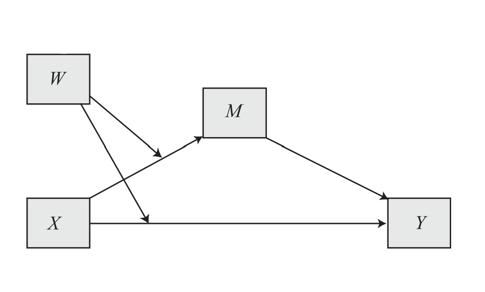 <br/>
]

---

## Different possibilities

.center[
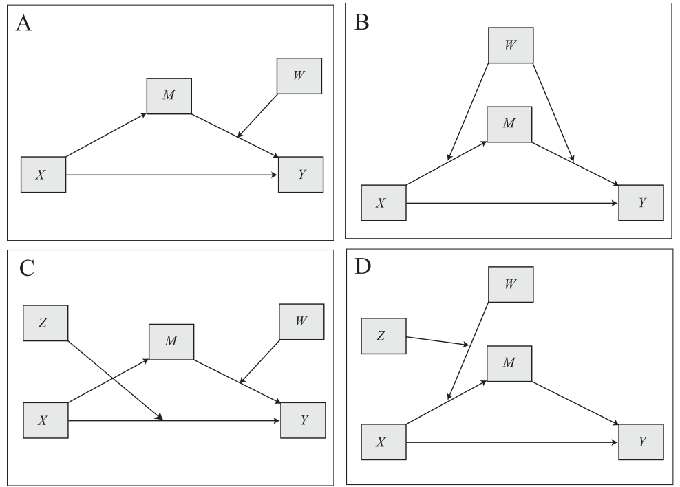 <br/>
]

---

## Comment on causality and correlation

SEM does not test causal relationship, there are no statistical procedures that do this <br/><br/><br/>

Mathematical tools that help us to understand the data, extract the signal and interpret it <br/> <br/>

---

## Lavaan in R syntax

.center[
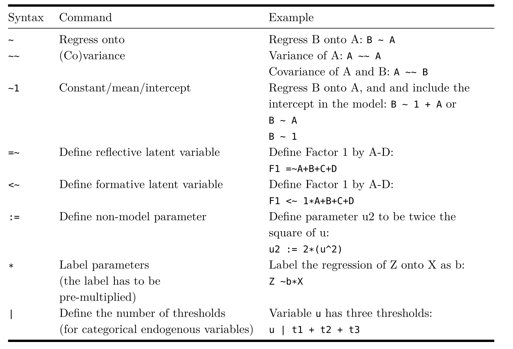 <br/>
]

---

## Linear regression in Lavaan

```{r,echo=F}
set.seed(456)
Babies=data.frame(Age=round(runif(100,1,30)), Weight=rnorm(100,4000,500))
Babies$Height=rnorm(100,40+0.2*Babies$Age+0.004*Babies$Weight, 5)
Babies$Gender=rbinom(100,1,0.5)
Babies$Crawl=rbinom(100,1,0.031*Babies$Age+0.00001*Babies$Weight-0.06*Babies$Gender)
Babies$TummySleep=rbinom(100,1,0.5)
Babies$PhysicalSt=rnorm(100,10+0.3*Babies$Height+0.1*Babies$Age-0.06*Babies$Gender+0.15*Babies$TummySleep,5)
Babies$Gender=as.factor(Babies$Gender)
levels(Babies$Gender)=c('Girls','Boys')
```

```{r, warning=FALSE, message=FALSE}
#install.packages('lavaan')
require(lavaan)
model1<-'
Height~1+Age #regression
'
fit1<-sem(model1, data=Babies)
```

.center[
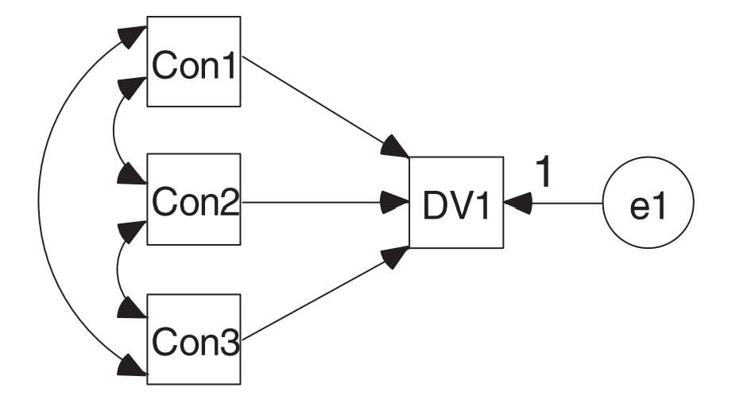 <br/>
]

---

## Summary of the model
```{css, echo=FALSE}
pre {
  max-height: 300px;
  overflow-y: auto;
}

pre[class] {
  max-height: 100px;
}
```

```{css, echo=FALSE}
.scroll-100 {
  max-height: 100px;
  overflow-y: auto;
  background-color: inherit;
}
```

```{r}
summary(fit1)
```

---

## Regression


```{r}
lm1<-lm(Height~Age, data=Babies)
summary(lm1)
```

---

## Visualisation

```{r, warning=FALSE, message=FALSE, fig.width=12, fig.height=5, fig.align='center'}
#install.packages('tidySEM')
require('tidySEM')
graph_sem(fit1, variance_diameter=.2)
```

---

## Interactions 1

We cannot add an interaction using _*_ sign as we would have in normal regression 

```{r}
model2<-'
Height~1+Age*Weight
'
fit2<-sem(model2, data=Babies)
summary(fit2)
```

---

## Interactions 2

We cannot add an interaction using _*_ sign as we would have in normal regression 

We need to create a new variable that codes the interaction

```{r}
Babies$AgeWeight = Babies$Age * Babies$Weight
Babies$AgeGender = Babies$Age * ifelse(Babies$Gender=='Girls',0,1) 
head(Babies)
```

---

## Interactions 3

We cannot add an interaction using __*__ sign as we would have in normal regression 

We need to create a new variable that codes the interaction

```{r}
model2<-'
Height~1+Age+Weight + AgeWeight
'
fit2<-sem(model2, data=Babies)
summary(fit2)
```

---

## Theory

Development of muscles in early months of infancy supports physical strenght, where as the time passes infants are becoming physically stronger. Infants that experience stronger early development, measured through their height also experience higher levels of physical strenght.  <br/> <br/>

Hypothethical assumptions:  <br/><br/>
Positive effect of age on the physical activity  <br/><br/>
Effect of age on physical activity is mediated by Babies height  <br/> 

---

## Specification of the model

Representation of our hypothetical assumptions in the form of the structural equation model

Let's check what our Babies think: 

.center[
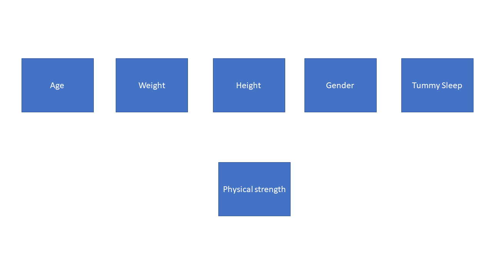 <br/>
]

---

## Representation of the model


.center[
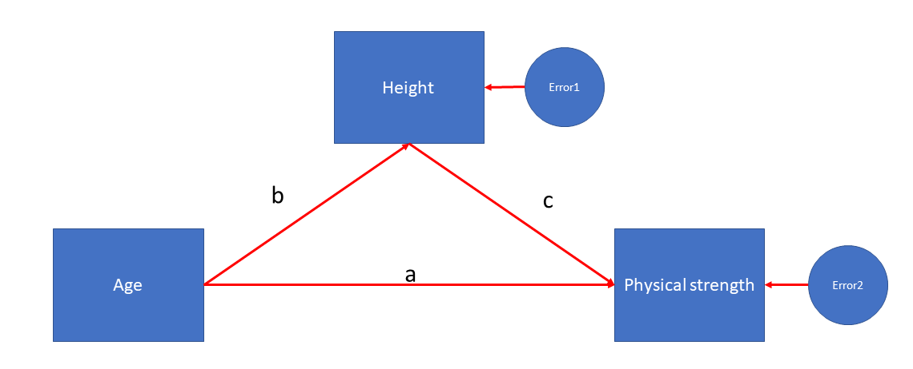 <br/>
]

---

## Estimation of the model

```{r}
modelStrength<-'
Height~Age
PhysicalSt~Age+Height
'
fitStr1<-sem(modelStrength, data=Babies)
summary(fitStr1)
```

---

## Visualisation of the results

```{r, warning=F, message=F, fig.width=12, fig.height=5, fig.align='center'}
require(semPlot)
semPaths(fitStr1, 'model','est', edge.label.cex = 1.1)
```

---

## What is the effect of Age? 

.center[

]

Direct effect: $a = -0.01$<br/>
Indirect effect: $b*c= 0.14 * 0.42$<br/>
Total effect: $a+(b*c)=-0.01+(0.14*0.42)$

---

## Age effects

```{r}
modelStrength<-'
Height~b*Age
PhysicalSt~a*Age+c*Height

##quantification of effects
dir := a
ind := b*c
tot := dir+ind
'
fitStr1<-sem(modelStrength, data=Babies)
summary(fitStr1)
```

---

## More pathways

```{r, echo=FALSE, out.width = '70%',fig.align='center'}
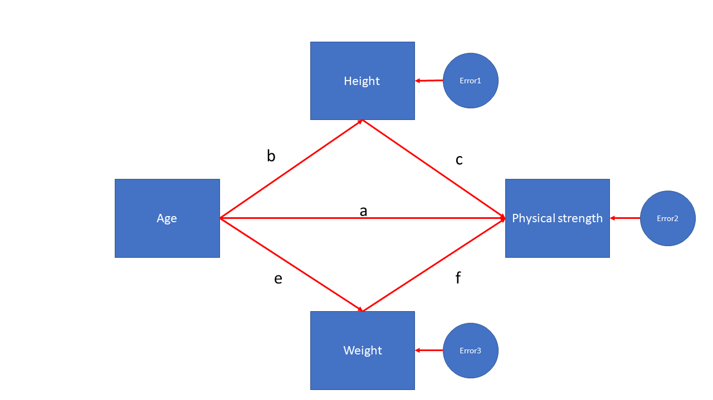
```

---

## Lets modify model

```{r}
modelStrength2<-'
Height~b*Age
Weight~e*Age
PhysicalSt~a*Age+c*Height+f*Weight

##quantification of effects
dir := a
ind := b*c+e*f
tot := dir+ind
'
```

---

## Results

```{r}
fitStr2<-sem(modelStrength2, data=Babies)
summary(fitStr2)
```

---

## Additional information

```{r}
parameterestimates(fitStr2, boot.ci.type ='bca.simple', standardized = T)
```

---

## Categorical variables: exogenous

```{r, echo=FALSE, out.width = '70%',fig.align='center'}
knitr::include_graphics("image5.png")
```
---

## Results: categorical predictor exogenous

```{r}
Babies$Gender=ifelse(Babies$Gender=='Girls',0,1)

modelStrength3<-'
Height~Age
PhysicalSt~Age+Height+Gender
'
fitStr3<-sem(modelStrength3, data=Babies)
summary(fitStr3)
```

---

## Categorical variables: endogenous

If it is endogenous (being predicted), then we need to specify this as a categorical variable and use different estimator (WLSMV)

```{r, echo=FALSE, out.width = '70%',fig.align='center'}
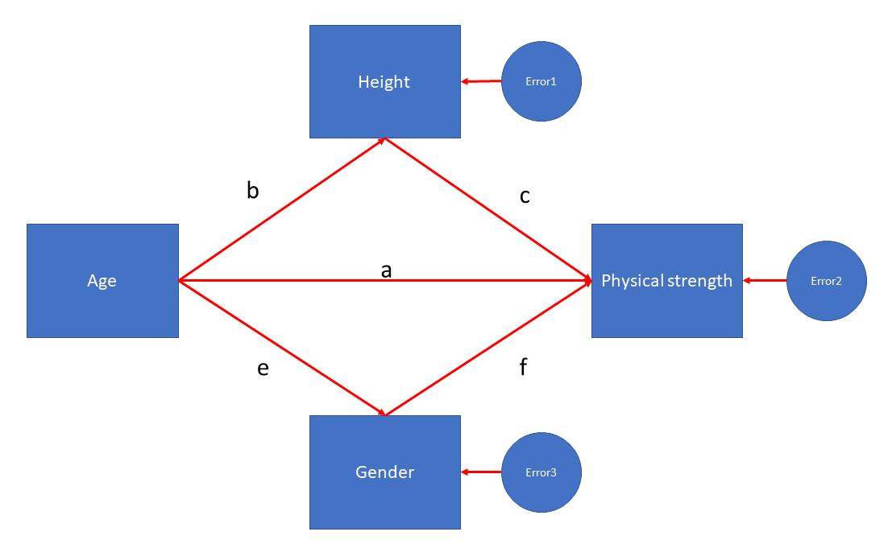
```

---

## Results: categorical predictor 2

```{r}
modelStrength4<-'
Height~Age
Gender~Age
PhysicalSt~Age+Height+Gender
'
fitStr4<-sem(modelStrength4, ordered = c('Gender'),data=Babies)
summary(fitStr4)
```

---

## Conditional process analysis

```{r}
modelStrengthCond<-'
Height~Age
PhysicalSt~Age+Height+AgeGender
'
```

```{r, echo=FALSE, out.width = '70%',fig.align='center'}
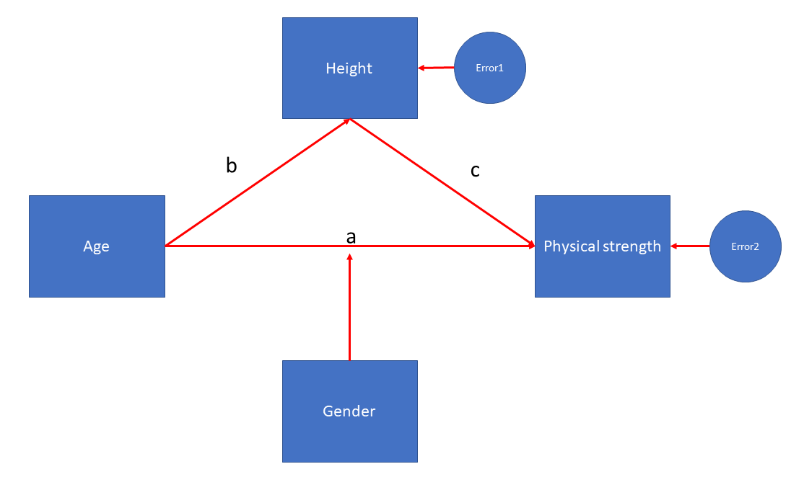
```
---
## Conditional process analysis: results

```{r}
fitStrCond<-sem(modelStrengthCond, data=Babies)
summary(fitStrCond)
```
---

## Intepretation of the predictors

```{r, echo=F}
summary(fitStr1)
```

Model predicts that: 
1 month older Babies are in average taller by 0.143  <br/><br/>
Comparing babies that have same height, but are 1 month older model predicts that they are on average weaker by 0.007 <br/>
Comparing babies that have same age, but are 1 cm taller model predicts that they are stronger by 0.425 <br/>
Indirect effect: for every __b__ (0.143) unit increase in the association between age and height, there is an __ind__ (0.061) increase in strenght of the babies
---

## Can model be estimated? 

Total Number of the parameters that we can estimate: $\frac{variables*(variables+1)}{2}$ <br/>


.center[

]

Three path coefficients  <br/>
Two error variances  <br/>
One independent variable variance <br/>

---

## Model identification

1. Underindentified: more free parameters than total possible parameters  <br/> <br/>
2. Just-identified: equal number of free parameters and total possible parameters  <br/><br/>
3. Overidentified: fewer free parameters than total possible parameters  <br/> <br/>
<br/>
Parameters can either be: free, fixed or constrained  <br/>

---

## Fixing parameters

```{r}
modelStrengthFix<-'
Height~Age
PhysicalSt~0  *Age+Height
'
fitStr1Fix<-sem(modelStrengthFix, data=Babies)
summary(fitStr1Fix)
```

---

## Constraining parameters

```{r}
modelStrengthCons<-'
Height~a*Age
PhysicalSt~a*Age+Height
'
fitStr1Cons<-sem(modelStrengthCons, data=Babies)
summary(fitStr1Cons)
```

---

## Overall fit: Chi-square test 

Measure of how well model-implied covariance matrix fits data covariance <br/> <br/>
We would prefer not to reject the null hypothesis in this case <br/>

Assumptions: <br/>
Multivariate normality <br/>
N is sufficiently large (150+)<br/>
Parameters are not at boundary or invalid (e.g. variance of zero)<br/><br/><br/>

With the large samples it is sensitive to small misfits <br/>
Nonormality induces bias <br/> 
---

## Overall fit: Other indices

.center[

]

---

## Fit indices of our model

```{r}
summary(fitStr1Cons, fit.measures=TRUE)
```

---

## Fit indices for our model

TLI: fit of .95 indicates that the fitted model improves the fit by 95% relative to the null mode, works OK with smaller sample sizes <br/> <br/>
CFI: Same as TLI, but not very sensitive to sample size <br/> <br/>
RMSEA: difference between the residuals of the sample covariance matrix and hypothesized model. If we have different scales it is hard to interpret, then we can check standardised root mean square residual (SRMR)<br/><br/>

---

class: inverse, middle, center
# Practical aspect
---

## Getting the data

Influence of the media upon subsequent actions: [Link](http://finzi.psych.upenn.edu/library/psych/html/tal_or.html)

```{r}
NBAPath<-read.table('NBApath.txt', sep='\t', header=T)
```
---

## What is in the data? 

```{r}
summary(NBAPath)
```

---

## Correlation matrix

```{r}
cor(NBAPath[,c(2,5:7)])
```

---

## Univariate plots

```{r, fig.width=12, fig.height=5, fig.align='center'}
par(mfrow=c(1,2), bty='n',mar = c(5, 4, .1, .1), cex=1.1, pch=16)
plot(density(NBAPath$PER), main='')
plot(density(NBAPath$PCT), main='')
```

---

## Bivariate plots

```{r,fig.width=12, fig.height=5, fig.align='center'}
par(mfrow=c(1,2), bty='n',mar = c(5, 4, .1, .1), cex=1.1, pch=16)
plot(NBAPath$Age, NBAPath$PER)
plot(NBAPath$GP, NBAPath$PER)
```

---

## Specification of the model 

```{r, echo=FALSE, out.width = '70%',fig.align='center'}
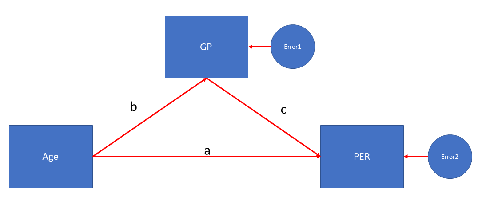
```


---

## Identification of the model


Three path coefficients  <br/>
Two error variances  <br/>
One independent variable variance <br/><br/><br/>

Number of distinct parameters that we can estimate: 3*4/2 = 6<br/><br/>

Just identified model<br/>

---

## Estimating the model

```{r}
NBAmod1<-'
GP~b*Age
PER~a*Age+c*GP

dir := a
ind := b*c
tot := dir + ind
'
NBAfit1<-sem(NBAmod1, data=NBAPath)
summary(NBAfit1)
```

---

## Explained variance - R2

When just identified model, we cannot use global indices of model fit <br/>
We need to use standard measures <br/>

```{r}
inspect(NBAfit1, 'r2')
-2*logLik(NBAfit1)
AIC(NBAfit1)
```

---

## Respecification of the model 

```{r, echo=FALSE, out.width = '70%',fig.align='center'}
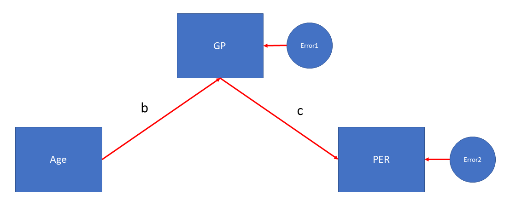
```

---

## Estimating the model

```{r}
NBAmod2<-'
GP~b*Age
PER~c*GP

ind := b*c
'
NBAfit2<-sem(NBAmod2, data=NBAPath)
summary(NBAfit2, fit.measures=T)
```
---

## Model comparison

```{r, warning=FALSE, message=FALSE}
#install.packages('semTools')
require(semTools)
diff<-compareFit(NBAfit1, NBAfit2)
summary(diff)
```

---

## Respecification of the model 

```{r, echo=FALSE, out.width = '70%',fig.align='center'}
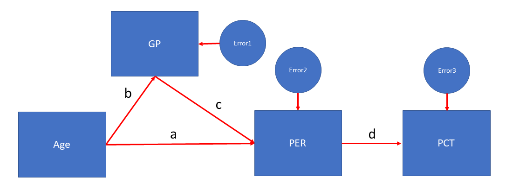
```

---

## Estimating the model

```{r, warning=FALSE, message=FALSE}
NBAmod3<-'
GP~b*Age
PER~a*Age+c*GP
PCT~d*PER
ind1 := b*c*d
ind2 := a*d
tot := ind1 + ind2
'
NBAfit3<-sem(NBAmod3, data=NBAPath)
summary(NBAfit3, fit.measures=T)
```

---

## Parameter estimates

```{r}
parameterestimates(NBAfit3, boot.ci.type ='bca.simple', standardized = T)
```

---

## Model building

.center[

]

---

## Bootstrapping our model

```{r}
#install.packages('bootstrap')
require(bootstrap)
boot<-bootstrapLavaan(NBAfit3, R=1000)
summary(boot)
```

---
## Important aspects: theory

- Difference between moderation, mediation and conditional process analysis <br/>
- Exogenous and endogenous variables <br/>
- Interpretation of the predictors <br/>
- Calculation of free parameters and total parameters <br/>
- Model identification: three-types of identifications <br/>
- Overall fit of the model 

---

## Important aspects: practice

- Building path model: both continous and categorical exogenous variables <br/>
- Calculation of the direct and indirect pathways for predictors of interest <br/>
- Adding an interaction to path model <br/>
- Interpretation of the coefficients <br/>
- Getting fit indices of the model <br/>

---
## Literature

Chapters 1 to 5 of Principles and Practice of Structural Equation Modeling by Rex B. Kline <br/><br/> 

Introduction to Mediation, Moderation, and Conditional Process Analysis: A Regression-Based Approach by Andrew F. Hayes <br/><br/> 

Latent Variable Modeling Using R: A Step-by-Step Guide by A. Alexander Beaujean <br/><br/>

---

# Thank you for your attention
