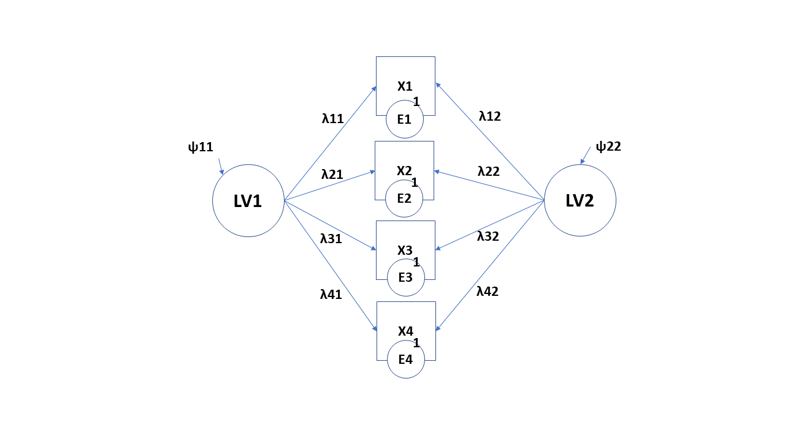
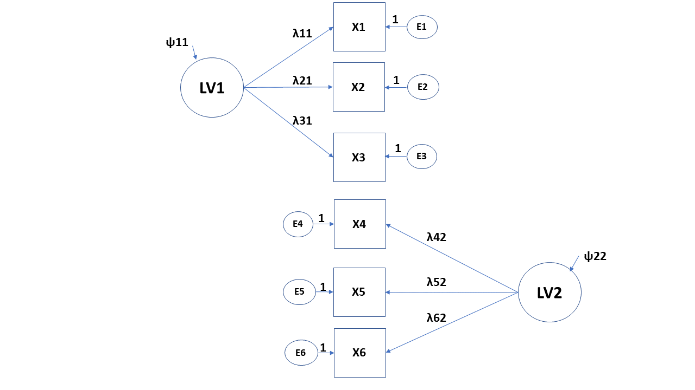
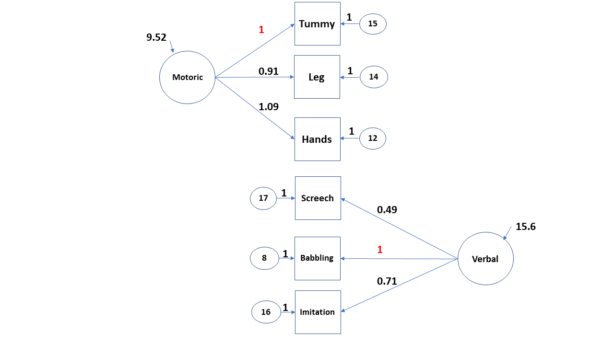
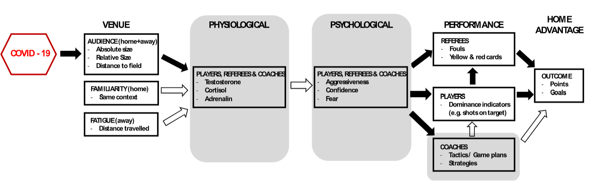
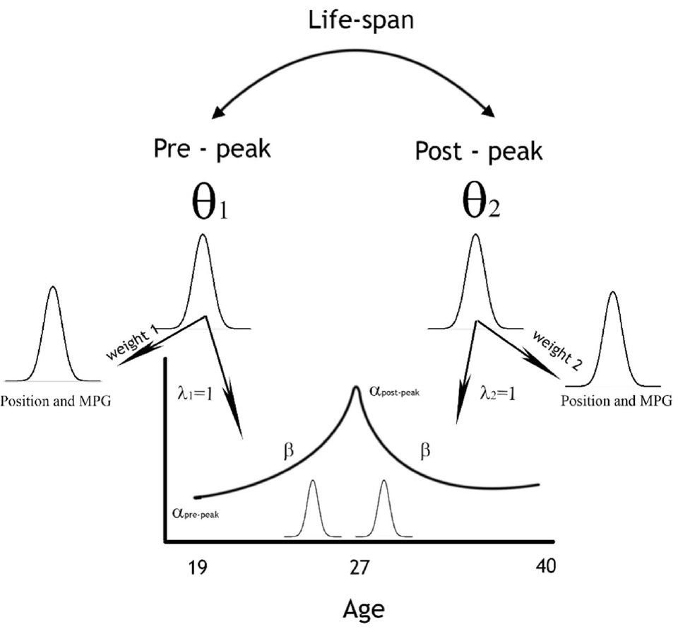
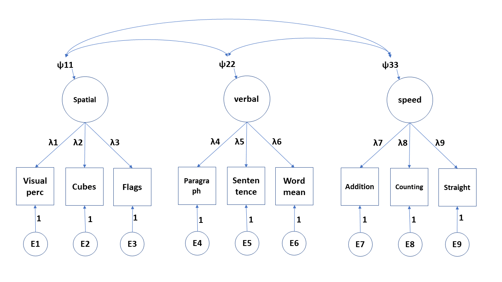
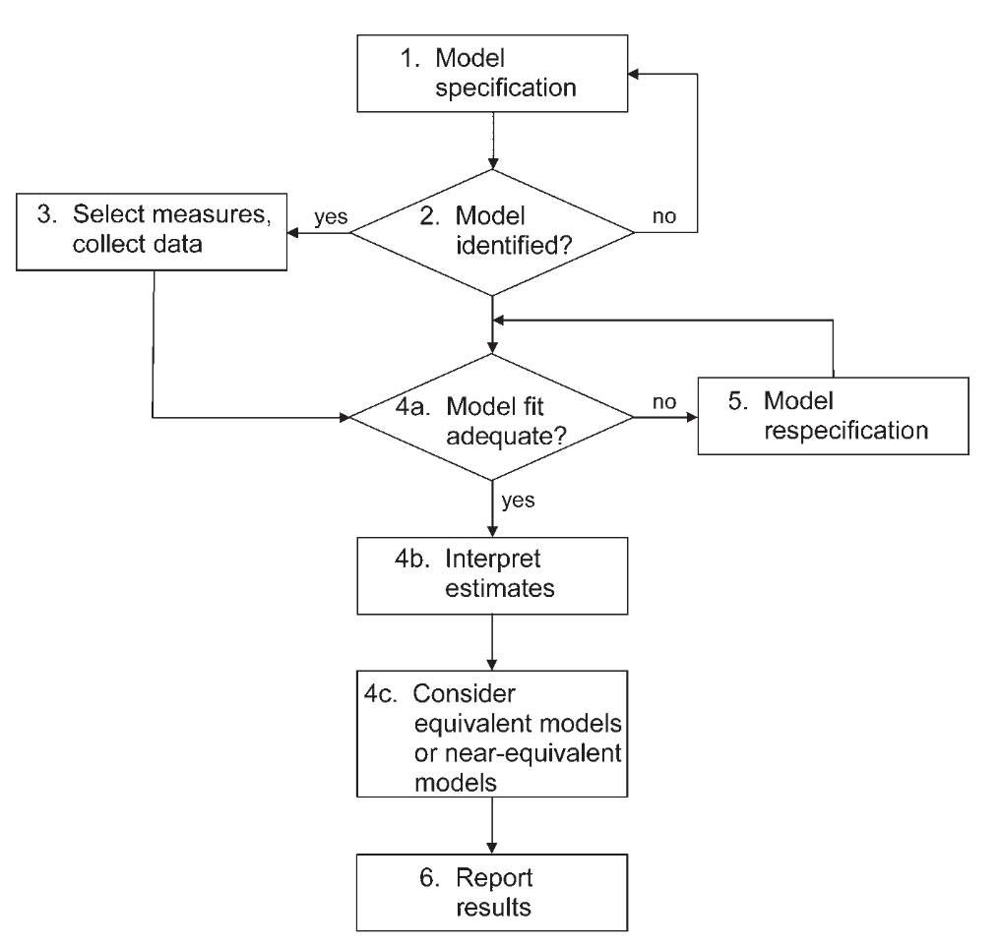

class: center, inverse
background-image: url("blindman2.jpg")
---

<style type="text/css">
body, td {
   font-size: 15px;
}
code.r{
  font-size: 15px;
}
pre {
  font-size: 20px
}
.huge .remark-code { /*Change made here*/
  font-size: 200% !important;
}
.tiny .remark-code { /*Change made here*/
  font-size: 80% !important;
}


</style>

## Press record

```{r xaringanExtra-share-again, echo=FALSE}
xaringanExtra::use_share_again()
xaringanExtra::style_share_again(background="rgba(0,0,0,.2)",share_buttons = c("twitter","facebook"))
```

---

## Corrections from previous lecture

---

## R code

[LINK](https://nvaci.github.io/Lecture_4_code/Lecture_4Rcode.html)

---

## In previous episode

We talked about: <br/><br/>
- Path modelling: observed variables<br/><br/>
- Theoretical pathways of influence<br/><br/>
- Causal interpretations <br/><br/>

---

## Confirmatory factor analysis <br/><br/>
- What is CFA <br/><br/>
- Major benefits <br/><br/>
- How to implement it in lavaan package in R <br/><br/>
- Full structural equation model: CFA + path <br/><br/>
- Measurement invariance and modification indices 

---

## Exploratory factor analysis (EFA)

Multivariate statistical procedure (Spearman): understanding and accounting for variation and covariation among of set of observed variables by postulating __latent__ structures (factors)<br/><br/>

Factor: unobservable variable that influences more than one observed measures and accounts for their intercorrelations <br/><br/>

If we partial out latent construct then intercorrelations would be zero <br/><br/>

Factor analysis decomposes variance: __a) common variance (communality)__ and __b) unique variance + random error variance (iniqueness)__

???
Thourough example of EFA in R: https://psu-psychology.github.io/psy-597-SEM/06_factor_models/factor_models.html#overview
---

## EFA versus CFA

Reproduce observer relationships between measured variables with smaller number of latent factors <br/><br/>

EFA is data-driven approach: weak or no assumptions on a number of latent dimensions and factor loadings (relations between indicators and factors) <br/> <br/>

CFA is theory-driven approach: strong assumptions for both things <br/><br/>

EFA is used earlier in the process of questionnaire development and construct validation

---

## Factor model

```{r, echo=FALSE, out.width = '90%',fig.align='center'}
knitr::include_graphics("image1.png")
```

---

## Factor or measurement model

Is linear regression where the main predictor is latent or unobserved:   <br/>

$$y_1=\tau_1+\lambda_1*\eta+\epsilon_1$$<br/><br/>
$y_1=\tau_1+\lambda_1*\eta+\epsilon_1$<br/>
$y_2=\tau_2+\lambda_2*\eta+\epsilon_2$<br/>
$y_3=\tau_3+\lambda_3*\eta+\epsilon_3$<br/><br/>

$\tau$ - the item intercepts or means<br/>
$\lambda$ - factor loadings - regression coefficients  <br/>
$\epsilon$ - error variances and covariances  <br/>
$\eta$ - the latent predictor of the items<br/>
$\psi$ - factor variances and covariances  <br/>
---

## Exploratory factor model

```{r, echo=FALSE, out.width = '90%',fig.align='center'}

```

---

## Confirmatory factor model

```{r, echo=FALSE, out.width = '90%',fig.align='center'}
knitr::include_graphics("image3.png")
```

---

## Assumptions

1. Error variances have mean of zero: $E(\epsilon_i)=0$  <br/> <br/>
2. Latent factors have mean of zero: $E(\eta)=0$  <br/> <br/>
3. Error variances are uncorrelated with each other: $cov(\epsilon_i,\epsilon_{-i})=0$  <br/> <br/>
4. Latent factors are uncorrelated with each other: $cov(\eta_i,\eta_{-i})=0$  <br/> <br/>
5. Latent factors are uncorrelated with error variances: $cov(\epsilon_i,\eta_i)$

---

## Parameters

```{r, echo=FALSE, out.width = '90%',fig.align='center'}
knitr::include_graphics("image3.png")
```
---

## Lets simulate some data: Babies

```{r, echo=FALSE}
set.seed(456)
Babies=data.frame(Age=round(runif(100,1,30)), Weight=rnorm(100,4000,500))
Babies$Height=rnorm(100,40+0.2*Babies$Age+0.004*Babies$Weight, 5)
Babies$Gender=rbinom(100,1,0.5)
Babies$Crawl=rbinom(100,1,0.031*Babies$Age+0.00001*Babies$Weight-0.06*Babies$Gender)
Babies$TummySleep=rbinom(100,1,0.5)
Babies$PhysicalSt=rnorm(100,10+0.3*Babies$Height+0.1*Babies$Age-0.06*Babies$Gender+0.15*Babies$TummySleep,5)
Babies$Gender=as.factor(Babies$Gender)
levels(Babies$Gender)=c('Girls','Boys')
```

```{r, warning=FALSE, message=FALSE}
#install.packages('faux')
require(faux)
set.seed(456)

cmat <- c(1, .4,.4, .1, .1, .1,
          .4, 1,.3, .1, .1, .1,
          .4,.2, 1, .1, .1, .1,
          .1,.1,.1,  1, .4, .4,
          .1,.1,.1, .4,  1, .2,
          .1,.1,.1, .4, .2,  1)

vars<-rnorm_multi(n=100, 6,30,5,cmat)

names(vars)=c('TimeOnTummy','PreciseLegMoves','PreciseHandMoves','Babbling','Screeching','VocalImitation')

Babies=cbind(Babies,vars)
```

---

## Our data

```{r}
options(digits=3)
head(Babies[,8:13])
```

---

## Our theory and knowledge (specification)

In our previous work, we postulated two __congeneric__ latent factors that explain variances and covariances of our six indicators: motoric and verbal latent component <br/><br/>

```{r, echo=FALSE, out.width = '65%',fig.align='center'}

```

---

## Latent Variable's Scale

As LVs are not directly observed, we need to set their scale:

1. Standardized latent variables: setting variance of variable to 1  (Z-score) <br/><br/>
2. Marker variable: single factor loading constraint to 1 <br/><br/>
3. Effects-coding: constraints that all of the loadings to one LV average 1.0 or that their sum is equal to number of indicators <br/><br/>

---

## Syntax in R

.center[
 <br/>
]
---

## Reflective versus formative LVs

Reflective: indicators of the construct are caused by the construct (eg. inteligence) <br/>

- Covariances between indicators 0, when we partial out LVs 

Formative: indicators are causing the latent variable (eg. value of a car)<br/>

- No assumptions on covariances 

---

## Coding of our model

```{r, message=FALSE, warning=FALSE}
#install.packages('lavaan')
require(lavaan)
model1<-'
motor =~ TimeOnTummy + PreciseLegMoves + PreciseHandMoves
verbal =~ Babbling + Screeching + VocalImitation
'

fit1<-cfa(model1, data=Babies)
```

```{css, echo=FALSE}
pre {
  max-height: 300px;
  overflow-y: auto;
}

pre[class] {
  max-height: 100px;
}
```

```{css, echo=FALSE}
.scroll-100 {
  max-height: 100px;
  overflow-y: auto;
  background-color: inherit;
}
```
---

## Results of the model

```{r}
summary(fit1)
```

---

## Results 2


```{r, echo=FALSE, out.width = '90%',fig.align='center'}

```

---

## Results 3


```{r, echo=FALSE, out.width = '90%',fig.align='center'}
knitr::include_graphics("image6.png")
```

---

## Interpretation of the coefficients: factor loadings

- When unstandardized and loaded on a single factor, then unstandardized regression coefficients. Model predicted difference in the LVs between groups that differ in 1-unit on the predictor <br/>  <br/>

- When loaded on multiple factors, then regression coefficients become contingent on other factors (check Lecture 1, slide 11)  <br/>  <br/>

- When standardized and loaded on a single factor (congeneric structure), then standardized loadings are estimated correlations between indicators and LVs <br/>  <br/>

- When standardized and loaded on a multiple factors, then same as the second option only standardized (beta weights)  <br/>

---

## Results of the model

```{r}
summary(fit1, standardized=TRUE)
```

---

## Scaling LVs: variance = 1 

```{r}
model2<-'
motor =~ NA*TimeOnTummy + PreciseLegMoves + PreciseHandMoves
verbal =~ NA*Babbling + Screeching + VocalImitation
motor ~~ 1*motor
verbal ~~ 1*verbal
'

fit2<-cfa(model2, data=Babies)
summary(fit2, standardized=TRUE)
```


---

## Adding intercepts

```{r}
model3<-'
motor =~ TimeOnTummy + PreciseLegMoves + PreciseHandMoves
verbal =~ Babbling + Screeching + VocalImitation
TimeOnTummy ~ 1
PreciseLegMoves ~ 1
PreciseHandMoves ~ 1
Babbling ~ 1
Screeching ~ 1 
VocalImitation ~ 1'
fit3<-cfa(model3, data=Babies)
summary(fit3, standardized=TRUE, fit.measures=T)
```

---


## Identification (Lecture 3)

Total number of parameters: $\frac{vars*(vars+1)}{2}=\frac{6*7}{2}=21$<br/><br/>

--

Variance-covariance matrix: 
```{r}
cov(Babies[,8:13])
```

---
## Estimated number of parameters

```{r, echo=FALSE, out.width = '50%',fig.align='center'}
knitr::include_graphics("image6.png")
```

Loadings $(\lambda)$: 4 parameters<br/><br/>
Residual variances $(\epsilon)$ : 6 parameters<br/><br/>
Factor variances and covariances $(\psi)$ : 3 parameters<br/><br/>
With intercepts: + 6 
---

## Indices of global model fit

```{r}
summary(fit1, fit.measures=TRUE)
```

---
class: inverse, middle, center
# Structural equation model
---

## Structural equation model 1

```{r}
model4<-'
#CFA model
motor =~ TimeOnTummy + PreciseLegMoves + PreciseHandMoves
verbal =~ Babbling + Screeching + VocalImitation

#Path model
motor ~ Age + Weight
verbal ~ Age + Weight
'

fit4<-sem(model4, data=Babies)
```
---
## Structural equation model 1: Results

```{r}
summary(fit4, standardized=TRUE)
```
---

## Structural equation model 2

```{r}
model5<-'
#CFA model
motor =~ TimeOnTummy + PreciseLegMoves + PreciseHandMoves
verbal =~ Babbling + Screeching + VocalImitation

#Path model
Height ~ Age
motor ~ Age + Weight + Height
verbal ~ Age + Weight + Height
'

fit5<-sem(model5, data=Babies)
```

---

## Structural equation model 2: results

```{r}
summary(fit5, standardized=TRUE)
```

---
class: inverse, middle, center
# Measurement invariance 
---

## Measurement invariance

Compare our model between the groups: <br/>
 - Configural invarience: Model fitted for each group separately<br/><br/>
 - Metric invariance: restriction of the factor loadings, but intercepts are allowed to vary <br/><br/>
 - Scalar invariance: restriction of the both, factor loadings and intercepts<br/><br/>
 - Strict invariance: restriction on factor loadings, intercepts and residual variances 


---

## Configural invariance

```{r, warning=FALSE, message=FALSE}
modelMI<-'
motor =~ TimeOnTummy + PreciseLegMoves + PreciseHandMoves
verbal =~ Babbling + Screeching + VocalImitation
'

fitMIC<-cfa(modelMI, data=Babies, group='Gender')
summary(fitMIC)
```

---

## Metric invariance: 1

```{r, warning=FALSE, message=FALSE}
modelMI<-'
motor =~ TimeOnTummy + PreciseLegMoves + PreciseHandMoves
verbal =~ Babbling + Screeching + VocalImitation
'

fitMIM<-cfa(modelMI, data=Babies, group='Gender',group.equal='loadings')
summary(fitMIM)
```

---

## Metric invariance: 2

```{r , warning=FALSE, message=FALSE}
#install.packages('semTools')
require(semTools)
summary(compareFit(fitMIC, fitMIM))
```

---

## Scalar invariance: 1

```{r , warning=FALSE, message=FALSE}
modelMI<-'
motor =~ TimeOnTummy + PreciseLegMoves + PreciseHandMoves
verbal =~ Babbling + Screeching + VocalImitation
'

fitMISc<-cfa(modelMI, data=Babies, group='Gender',group.equal=c('loadings','intercepts'))
summary(fitMISc)
```

---

## Scalar invariance: 2

```{r}
summary(compareFit(fitMIM,fitMISc))
```

---

## Strict invariance: 1

```{r}
modelMI<-'
motor =~ TimeOnTummy + PreciseLegMoves + PreciseHandMoves
verbal =~ Babbling + Screeching + VocalImitation
'

fitMISt<-cfa(modelMI, data=Babies, group='Gender',group.equal=c('loadings','intercepts','residuals'))
summary(fitMISt)
```

---

## Strict invariance: 2

```{r}
summary(compareFit(fitMISc,fitMISt))
```

---

## Where are the differences

```{r}
lavTestScore(fitMISc)
```

---
class: inverse, middle, center
# Modification indices
---

## Modification indices

What if? <br/>
New relations suggested by the measures of fit:

```{r}
mi <- modindices(fit1)
mi[mi$op == "=~"]
```

---
class: inverse, middle, center
# Examples
---

## Theory: Home-advantage in sports

<br/><br/>
```{r, echo=FALSE, out.width = '90%',fig.align='center'}

```
---

## Specification and results: HA in sports

```{r, echo=FALSE, out.width = '70%',fig.align='center'}
knitr::include_graphics("HA.png")
```

---

## Bayesian CFA with structural model

```{r, echo=FALSE, out.width = '50%',fig.align='center'}

```
---
class: inverse, middle, center
# Practical aspect
---

## Theory and data

Holzinger and Swineford data (1939) - [LINK](https://www.rdocumentation.org/packages/psychTools/versions/2.0.8/topics/holzinger.swineford) <br/>

```{r, message=FALSE, warning=FALSE}
#install.packages('sem')
require(sem)
data('HS.data')
```

```{r, echo=FALSE, out.width = '70%',fig.align='center'}

```
---

## Checking the data

```{r}
dim(HS.data)
summary(HS.data[,c('visual','cubes','flags','paragrap','sentence','wordm','addition','counting','straight')])
```

You can also plot univariate probability density functions (see Lecture 1 and 2) 

---

## Multivariate normality

```{r, warning=FALSE, message=FALSE,out.width = '40%',fig.align='center'}
#install.packages('psych')
require(psych)
scatter.hist(x=HS.data$visual,y=HS.data$cubes, density = T, ellipse = T)
```
---

## Model identification (LVs scale marker variable)

Calculate number of parameters:  <br/> <br/>

6 loadings + 9 residual variances + 3 LVs variances + 3 LVs covariances = 21 free parameters<br/><br/>

Total number of parameters = 9*(9+1)/2 = 45<br/><br/>

Overidentified model!
---

## Model

```{r}
detach('package:sem')
fact3<-'
spatial =~ visual + cubes + flags
verbal =~ paragrap + sentence + wordm
speed =~ addition + counting + straight
'

fact3fit<-cfa(fact3, data=HS.data)
summary(fact3fit, fit.measures=TRUE ,standardized=TRUE)
```

---

## Explained variance - R2

```{r}
inspect(fact3fit,'r2')
```

---

## Checking multivariate normality

```{r, warning=FALSE, message=FALSE}
#install.packages('MVN')
require(MVN)
test<-mvn(HS.data[,c('visual','cubes','flags','paragrap','sentence','wordm','addition','counting','straight')], mvnTest = 'royston')
test$multivariateNormality
```

---

## What can we do

1. Bootstrap our results <br/><br/>
2. Use robust standard errors <br/><br/>
3. Change test statistic (eg. Satorra Bentler) <br/><br/>

---

## Robust standard errors

```{r}
fact3fitRob<-cfa(fact3, data=HS.data, se='robust.sem',test='satorra.bentler')
summary(fact3fitRob,standardized=TRUE)
```

---

## Modification indices

```{r}
mi <- modindices(fact3fitRob)
mi
```

---

## Change the model

```{r}
fact3A<-'
spatial =~ visual + cubes + flags + straight + addition
verbal =~ paragrap + sentence + wordm
speed =~ addition + counting + straight
'

fact3AfitRob<-cfa(fact3A, data=HS.data,se='robust.sem',test='satorra.bentler')
summary(fact3AfitRob, fit.measures=TRUE ,standardized=TRUE)
```

---

## Compare the models

```{r}
diff<-compareFit(fact3fitRob, fact3AfitRob)
summary(diff)
```

---

## Model development 

```{r, echo=FALSE, out.width = '50%',fig.align='center'}

```

---

## Important aspects: theory 

- Understanding differences between Exploratory FA and Confirmatory FA <br/>
- How is linear model defined in the CFA<br/>
- Assumptions of the CFA <br/>
- Scaling of the latent variables <br/>
- Interpretation of the coefficients <br/>
- Number of free parameters versus total number of parameters <br/>

---

## Important aspects: practice

- Specifying and estimating CFA model <br/>
- Scaling the LVs by using marker variable or by scaling LVs variance to 1<br/>
- Adding intercepts to your CFA model <br/>
- Making a full SEM model <br/>

---

## Literature

Confirmatory Factor Analysis for Applied Research by Timothy A. Brown  <br/> <br/>

Chapters 9 of Principles and Practice of Structural Equation Modeling by Rex B. Kline <br/><br/> 


Latent Variable Modeling Using R: A Step-by-Step Guide by A. Alexander Beaujean <br/><br/>

---

## Thank you for your attention