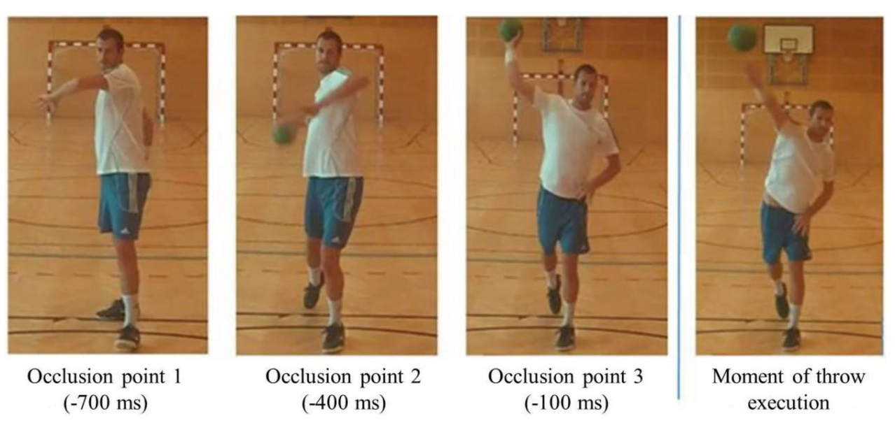
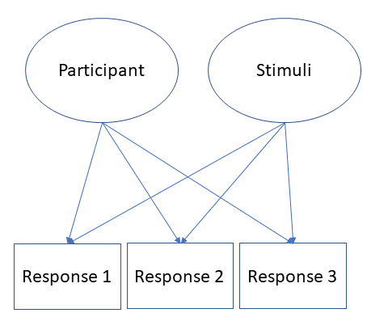

class: center
background-image: url("wundt.png")
background-size: contain
---


<style type="text/css">
body, td {
   font-size: 15px;
}
code.r{
  font-size: 15px;
}
pre {
  font-size: 20px
}
.huge .remark-code { /*Change made here*/
  font-size: 200% !important;
}
.tiny .remark-code { /*Change made here*/
  font-size: 80% !important;
}


</style>

## Press record

```{r xaringanExtra-share-again, echo=FALSE}
xaringanExtra::use_share_again()
xaringanExtra::style_share_again(background="rgba(0,0,0,.2)",share_buttons = c("twitter","facebook"))
```

---

## Corrections from the previous lecture

---

## R code

[LINK](https://nvaci.github.io/Lecture_6_code/Lecture_6code.html)

---

## Multilevel models 

Generalization of regression $(y_i=\alpha+\beta*x_i+\epsilon_i)$, where we allow adjustments of: <br/><br/>
- Intercept: $y_i = \alpha_{j[i]}+\beta*x_i+\epsilon_i$ <br/><br/>
- Slope: $y_i=\alpha*\beta_{j[i]}*x_i+\epsilon_i$ <br/><br/>
- Both: $y_i=\alpha_{j[i]}*\beta_{j[i]}*x_i+\epsilon_i$

---

## Analysis of the data

1. Complete pooling - take into account all observations, without hierarchical categories <br/><br/>
2. No pooling - adjust regression for each hierarchical category  <br/> <br/>
3. Partial pooling - use categories to weight individual estimates <br/> <br/>

---

## Babies

```{r, echo=FALSE, message=FALSE, warning=FALSE}
require(tidyverse)
set.seed(4567)
alpha_0 <-1000 #intercept value 
beta_1 <- 100 #slope
omega_0<- 20
tau_0 <- 40 
tau_1 <- 10 
rho <- .35
sigma <- 200

n_subj<-10
n_items<-10

items <- data.frame(
  item_id = seq_len(n_items),
  O_0i = rnorm(n = n_items, mean = 0, sd = omega_0)
)

items$block=1:10

subjects <- faux::rnorm_multi(
  n = n_subj,
  mu = 0, # means for random effects are always 0
  sd = c(tau_0, tau_1), # set SDs
  r = rho, # set correlation, see ?rnorm_multi
  varnames = c("T_0s", "T_1s")
)

# add subject IDs
subjects$subj_id <- seq_len(n_subj)

trials <- crossing(subjects, items)  %>%
  mutate(e_si = rnorm(nrow(.), mean = 0, sd = sigma))


Babies <- trials %>%
  mutate(RT = alpha_0 + T_0s + O_0i + (beta_1 + T_1s) * block + e_si) %>%
  select(subj_id, item_id, block,RT)
```

```{r, warning=FALSE, message=FALSE, fig.width=12, fig.height=5, fig.align='center'}
#install.packages('ggplot2')
require(ggplot2)
ggplot(data=Babies, aes(block, RT, group=subj_id))+geom_line()+geom_point()
```

---

## Mixed-effect model: intercept

```{r, warning=FALSE, message=FALSE}
#install.packages('lme4')
require(lme4)
lmer1<-lmer(RT~block+(1|subj_id)+(1|item_id), data=Babies)
summary(lmer1)
```

---

## Fixed effects - predictors

```{r, warning=FALSE, message=FALSE, fig.width=12, fig.height=5, fig.align='center'}
#install.packages('sjPlot')
require(sjPlot)
plot_model(lmer1, type='pred')
```

---

## Random effects - subjects

```{r, fig.width=12, fig.height=5, fig.align='center'}
plot_model(lmer1, type='re')[1]
```

---

## Baby 10 as an outlier

```{r, fig.width=12, fig.height=5, fig.align='center'}
Babies$RT=ifelse(Babies$subj_id==10, Babies$RT+500, Babies$RT)
ggplot(data=Babies, aes(block, RT, group=subj_id))+geom_line()+geom_point()
```

---

## Random effects 2

```{r, fig.width=12, fig.height=5, fig.align='center'}
lmer1a<-lmer(RT~block+(1|subj_id)+(1|item_id), data=Babies)
plot_model(lmer1a, type='re')[1]
```

---

## Baby 10 with missing data

```{css, echo=FALSE}
pre {
  max-height: 300px;
  overflow-y: auto;
}

pre[class] {
  max-height: 100px;
}
```

```{css, echo=FALSE}
.scroll-100 {
  max-height: 100px;
  overflow-y: auto;
  background-color: inherit;
}
```

```{r, echo=FALSE}
for(i in 1:6){
    k=which(Babies$subj_id==10)[i]
    Babies$RT[k]=NA
}
```

```{r,fig.width=12, fig.height=5, fig.align='center'}
lmer1b<-lmer(RT~block+(1|subj_id)+(1|item_id), data=Babies)
plot_model(lmer1b, type='re')[1]
```

---

## More uncertainty

```{r, echo=FALSE}
for(i in 7:9){
    k=which(Babies$subj_id==10)[i]
    Babies$RT[k]=NA
}
```

```{r,fig.width=12, fig.height=5, fig.align='center'}
lmer1c<-lmer(RT~block+(1|subj_id), data=Babies)
plot_model(lmer1c, type='re')
```


---

## What does that mean practically

If there we have large variance between participants' behaviour and large number of observations for each participant -> mixed-effect model will be similar to the no pooling situation  <br/><br/>

If we have small variances between participants' behaviour and large number of observations for each participant -> mixed effect model will be similar to the complete pooling situation <br/><br/>

In any other case (medium sized variances, different number of observations per participants, outliers etc.) -> mixed-effect model will be a compromise between these two cases <br/><br/>

---

## Advice

You should always use mixed-effect models! <br/><br/>

---

## Handball experiment

```{r, echo=FALSE, out.width = '80%',fig.align='center'}

```

```{r}
Handball<-read.table('Handball_data.txt', sep='\t', header=T)
```

---

## Handball dataset

```{r, echo=FALSE}
Handball$Video2=substr(Handball$Video,1,nchar(as.character(Handball$Video))-2)
Handball$Subject=as.factor(Handball$Subject)
Handball$Stim=as.factor(Handball$Stim)
Handball$Exp=as.factor(Handball$Exp)
Handball$Direction=as.factor(Handball$Direction)
Handball$Shot=as.factor(Handball$Shot)
Handball$Time=as.factor(Handball$Time)
Handball$RT2=log(Handball$RT)
```

```{r}
head(Handball[,c('Subject','Time','Answer','Video2','RT2')])
```

---

## Random effects

```{r, echo=FALSE, out.width = '50%',fig.align='center'}

```

---

## Linear mixed-effect model

```{r}
lmerRT<-lmer(RT2~Exp*Time+(1|Subject)+(1|Video2), data=Handball)
print(summary(lmerRT), cor=F)
```

---

## Visualisation of the results

```{r, echo=FALSE, fig.width=12, fig.height=5, fig.align='center', warning=FALSE, message=FALSE}
#install.packages('effects')
require(effects)
eff.p1 <- effect("Exp*Time", lmerRT, confidence.level=0.68)
eff.p1 <- as.data.frame(eff.p1)
eff.p1$fit=exp(eff.p1$fit)
eff.p1$lower=exp(eff.p1$lower)
eff.p1$upper=exp(eff.p1$upper)
levels(eff.p1$Exp)=c('Experts','Novices',NA)
names(eff.p1)[1]='Expertise'

ggplot(eff.p1, aes(Time,fit, group=Expertise, color=Expertise))+geom_line(aes(linetype=Expertise),size=1)+geom_point(aes(shape=Expertise), size=3, colour='black')+scale_shape_manual(values=c(1,15))+scale_linetype_manual(values=c(1,2))+scale_color_manual(values=c('red1','navyblue'))+geom_errorbar(aes(ymin=lower, ymax=upper), width=.2, position=position_dodge(0.03))+theme_bw()+xlab('\nTimepoint')+ylab('Reaction time (ms)\n')+theme(axis.title=element_text(size=18), axis.text=element_text(size=16, face="bold", colour='black'), legend.text=element_text(size=16), legend.title=element_text(size=18),axis.line = element_line(colour = "black"),panel.grid.major = element_blank(),panel.grid.minor = element_blank(),panel.border = element_blank(),panel.background = element_blank())
```

---
class: inverse, middle, center
# Beyond linear mixed-effect models 
---

## Generalized linear mixed-effect model

Logistic regression:

```{r}
AccMod<-glmer(Answer~Exp*Time+(1|Subject)+(1|Video2), data=Handball, family=binomial('logit'))
summary(AccMod)
```

---

## Visualisation of the results

```{r}
eff.p2 <- effect("Exp*Time", AccMod,confidence.level=0.68)
eff.p2 <- as.data.frame(eff.p2)

levels(eff.p2$Exp)=c('Experts','Novices',NA)
names(eff.p2)[1]='Expertise'
```

```{r,echo=FALSE, fig.width=12, fig.height=5, fig.align='center'}
ggplot(eff.p2, aes(Time,fit, group=Expertise, color=Expertise))+geom_line(aes(linetype=Expertise),size=1)+geom_point(aes(shape=Expertise), size=3, colour='black')+scale_shape_manual(values=c(1,15))+scale_linetype_manual(values=c(1,2))+scale_color_manual(values=c('red1','navyblue'))+geom_errorbar(aes(ymin=lower, ymax=upper), width=.2, position=position_dodge(0.03))+theme_bw()+xlab('\nTimepoint')+ylab('Accuracy')+theme(axis.title=element_text(size=18), axis.text=element_text(size=16, face="bold", colour='black'), legend.text=element_text(size=16), legend.title=element_text(size=18),axis.line = element_line(colour = "black"),panel.grid.major = element_blank(),panel.grid.minor = element_blank(),panel.border = element_blank(),panel.background = element_blank())
```

---

## Mixed-effect Path models

PiecewiseSEM package: [LINK](https://cran.r-project.org/web/packages/piecewiseSEM/vignettes/piecewiseSEM.html) <br/><br/>

Book: Cause and Correlation in Biology: A User's Guide to Path Analysis, Structural Equations and Causal Inference with R  

---

## Nonlinear modelling

Generalized additive mixed-effect modelling <br/><br/>

Jacoline van Rij: [LINK](https://jacolienvanrij.com/Tutorials/GAMM.html)  <br/><br/>

Modelling mouse movement in the experimental setting: [LINK](https://library.oapen.org/bitstream/handle/20.500.12657/37598/9783110440577.pdf?sequence=1#page=91)

---

## Bayesian modelling 

brms package in R: [LINK](https://paul-buerkner.github.io/brms/) <br/><br/>

Families in brms: [LINK](https://rdrr.io/cran/brms/man/brmsfamily.html) <br/><br/>

Andrew Gelman's blog: [LINK]( https://statmodeling.stat.columbia.edu/)

---
class: inverse, middle, center
# PSY6210: Advanced statistical methods for Psychologists 
---
## Recap of our work

Introduction to various advanced statistical models <br/><br/><br/><br/>
General linear model as a basis for all other models: $y = \alpha + \beta * x + \epsilon$ <br/><br/><br/><br/>
.pull-left[
GLMs:<br/>
$log(\frac{p_{i}}{1-p_{i}}) =  \alpha+\beta*x_i$<br/><br/>

Path models: <br/> 
$y_1 = \alpha_1 + \beta_1 * x + \epsilon_1$ <br/>
$y_2 = \alpha_2 + \beta_2 * x +\beta_3*y_1 + \epsilon_2$
]
.pull-right[
CFA:<br/>
$y_1=\tau_1+\lambda_1*\eta+\epsilon_1$<br/><br/><br/>

Mixed-effect model: <br/>
$y_i=\alpha_{j[i]}*\beta_{j[i]}*x_i+\epsilon_i$ <br/>
]

---
## Materials 1

Each lecture was trying to explain statistical theory and motivate why and when would you want to use covered models <br/><br/>

There are no recipes and that the best approach is to read and investigate these topics further, but also experiment with the models <br/><br/> 

Topics that go beyond the general introduction to the statistical procedures <br/>  <br/>

Showcase possibilities of these models and introduce you to more advanced topics  <br/> <br/>

---

## Materials 2

Presentations + commented code for each lecture is online <br/><br/>

Simulations for theoretical part <br/> <br/>

Using simulations to understand and test your models! <br/><br/> 
Chapter 8 of "Data Analysis Using Regression and Multilevel/Hierarchical Models" by Andrew Gelman and Jennifer Hill

---

## Thank you for your attention 


